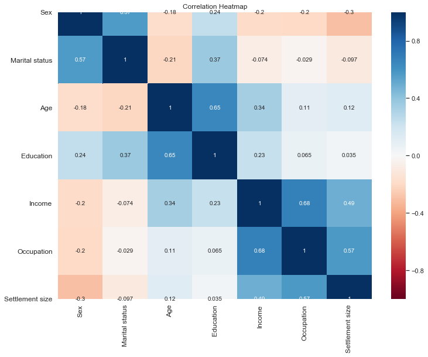
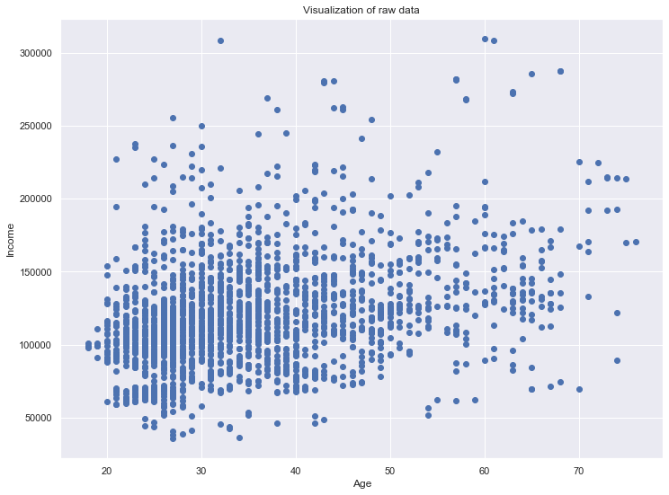
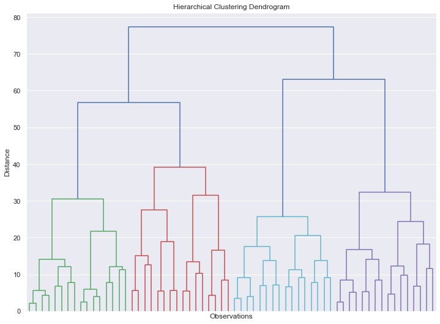
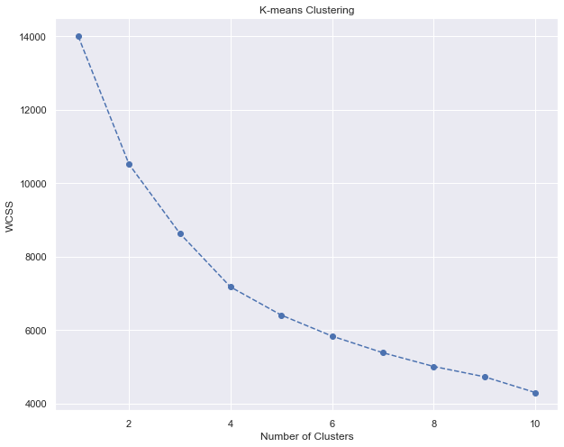
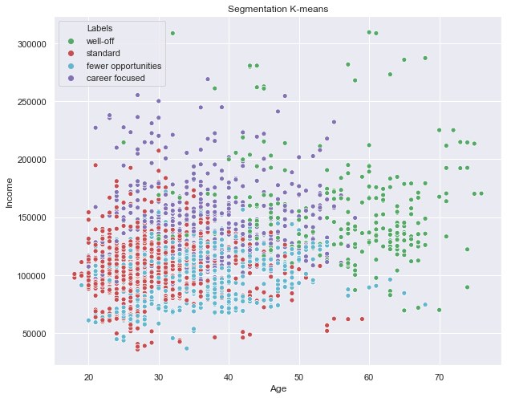
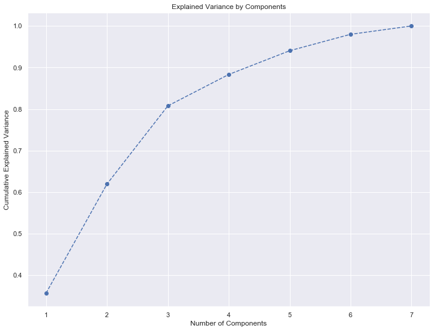
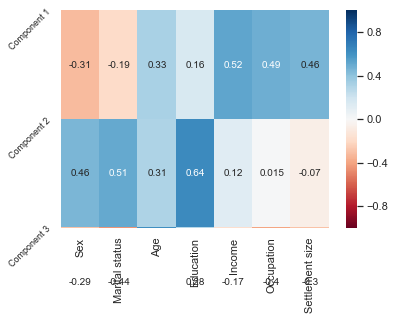
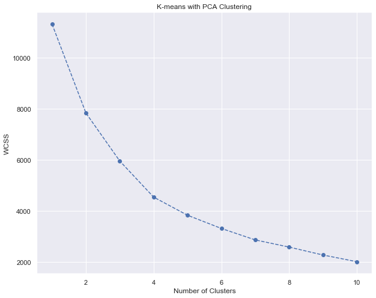
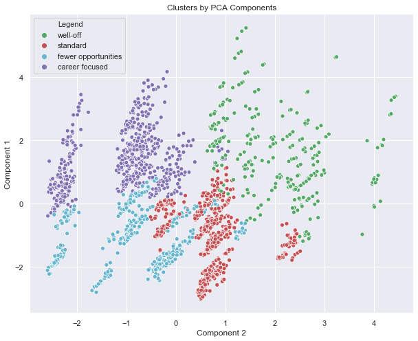

###Customers Data segmentation using PCA and K-means

This is a quick project where I'll demonstrate the correct way to segment customers data
for further analysis

The purpose of customers analytics is to provide new usefull insights, lets see how we can approach this task using python.


```python
import numpy as np
import pandas as pd
import scipy
import matplotlib.pyplot as plt
import seaborn as sns
sns.set()
from sklearn.preprocessing import StandardScaler
from scipy.cluster.hierarchy import dendrogram, linkage
from sklearn.cluster import KMeans
from sklearn.decomposition import PCA
```


```python
df = pd.read_csv('segmentation data.csv', index_col = 0)
```


```python
# Descriptive analysis of the data set. Here we just look at the data to gain some insight. 
# We do not apply any transformations or changes to the data.
df.head()
```


```python
# Compute Pearson correlation coefficient for the features in our data set.
# The correlation method in pandas, it has the Pearson correlation set as default.
df_segmentation.corr()
```


<div>
<style scoped>
    .dataframe tbody tr th:only-of-type {
        vertical-align: middle;
    }

    .dataframe tbody tr th {
        vertical-align: top;
    }

    .dataframe thead th {
        text-align: right;
    }
</style>
<table border="1" class="dataframe">
  <thead>
    <tr style="text-align: right;">
      <th></th>
      <th>Sex</th>
      <th>Marital status</th>
      <th>Age</th>
      <th>Education</th>
      <th>Income</th>
      <th>Occupation</th>
      <th>Settlement size</th>
    </tr>
  </thead>
  <tbody>
    <tr>
      <th>Sex</th>
      <td>1.000000</td>
      <td>0.566511</td>
      <td>-0.182885</td>
      <td>0.244838</td>
      <td>-0.195146</td>
      <td>-0.202491</td>
      <td>-0.300803</td>
    </tr>
    <tr>
      <th>Marital status</th>
      <td>0.566511</td>
      <td>1.000000</td>
      <td>-0.213178</td>
      <td>0.374017</td>
      <td>-0.073528</td>
      <td>-0.029490</td>
      <td>-0.097041</td>
    </tr>
    <tr>
      <th>Age</th>
      <td>-0.182885</td>
      <td>-0.213178</td>
      <td>1.000000</td>
      <td>0.654605</td>
      <td>0.340610</td>
      <td>0.108388</td>
      <td>0.119751</td>
    </tr>
    <tr>
      <th>Education</th>
      <td>0.244838</td>
      <td>0.374017</td>
      <td>0.654605</td>
      <td>1.000000</td>
      <td>0.233459</td>
      <td>0.064524</td>
      <td>0.034732</td>
    </tr>
    <tr>
      <th>Income</th>
      <td>-0.195146</td>
      <td>-0.073528</td>
      <td>0.340610</td>
      <td>0.233459</td>
      <td>1.000000</td>
      <td>0.680357</td>
      <td>0.490881</td>
    </tr>
    <tr>
      <th>Occupation</th>
      <td>-0.202491</td>
      <td>-0.029490</td>
      <td>0.108388</td>
      <td>0.064524</td>
      <td>0.680357</td>
      <td>1.000000</td>
      <td>0.571795</td>
    </tr>
    <tr>
      <th>Settlement size</th>
      <td>-0.300803</td>
      <td>-0.097041</td>
      <td>0.119751</td>
      <td>0.034732</td>
      <td>0.490881</td>
      <td>0.571795</td>
      <td>1.000000</td>
    </tr>
  </tbody>
</table>
</div>


```python
# We'll plot the correlations using a Heat Map. Heat Maps are a great way to visualize correlations using color coding.
# We use RdBu as a color scheme, but you can use viridis, Blues, YlGnBu or many others.
# We set the range from -1 to 1, as it is the range of the Pearson Correlation. 
# Otherwise the function infers the boundaries from the input.
# In this case they will be -0,25 to 0,68, as they are the minumum and maximum correlation indeces between our features.
plt.figure(figsize = (12, 9))
s = sns.heatmap(df_segmentation.corr(),
               annot = True, 
               cmap = 'RdBu',
               vmin = -1, 
               vmax = 1)
s.set_yticklabels(s.get_yticklabels(), rotation = 0, fontsize = 12)
s.set_xticklabels(s.get_xticklabels(), rotation = 90, fontsize = 12)
plt.title('Correlation Heatmap')
plt.show()
```





## ${\textbf{Visualize Raw Data}}$


```python
# We'll plot the data. We create a 12 by 9 inches figure.
# We have 2000 data points, which we'll scatter acrros Age and Income, located on positions 2 and 4 in our data set. 
plt.figure(figsize = (12, 9))
plt.scatter(df_segmentation.iloc[:, 2], df_segmentation.iloc[:, 4])
plt.xlabel('Age')
plt.ylabel('Income')
plt.title('Visualization of raw data')
```


    Text(0.5, 1.0, 'Visualization of raw data')





## ${\textbf{Standardization}}$


```python
# Standardizing data, so that all features have equal weight. This is important for modelling.
# Otherwise, in our case Income would be considered much more important than Education for Instance. 
# We do not know if this is the case, so we would not like to introduce it to our model. 
# This is what is also refered to as bias.
scaler = StandardScaler()
segmentation_std = scaler.fit_transform(df_segmentation)
```

## ${\textbf{Hierarchical Clustering}}$


```python
# Perform Hierarchical Clustering. The results are returned as a linkage matrix. 
hier_clust = linkage(segmentation_std, method = 'ward')
```


```python
# We plot the results from the Hierarchical Clustering using a Dendrogram. 
# We truncate the dendrogram for better readability. The level p shows only the last p merged clusters
# We also omit showing the labels for each point.
plt.figure(figsize = (12,9))
plt.title('Hierarchical Clustering Dendrogram')
plt.xlabel('Observations')
plt.ylabel('Distance')
dendrogram(hier_clust,
           truncate_mode = 'level', 
           p = 5, 
           show_leaf_counts = False, 
           no_labels = True)
plt.show()
```





## ${\textbf{K-means Clustering}}$


```python
# Perform K-means clustering. We consider 1 to 10 clusters, so our for loop runs 10 iterations.
# In addition we run the algortihm at many different starting points - k means plus plus. 
# And we set a random state for reproducibility.
wcss = []
for i in range(1,11):
    kmeans = KMeans(n_clusters = i, init = 'k-means++', random_state = 42)
    kmeans.fit(segmentation_std)
    wcss.append(kmeans.inertia_)
```


```python
# Plot the Within Cluster Sum of Squares for the different number of clusters.
# From this plot we choose the number of clusters. 
# We look for a kink in the graphic, after which the descent of wcss isn't as pronounced.
plt.figure(figsize = (10,8))
plt.plot(range(1, 11), wcss, marker = 'o', linestyle = '--')
plt.xlabel('Number of Clusters')
plt.ylabel('WCSS')
plt.title('K-means Clustering')
plt.show()
```





```python
# We run K-means with a fixed number of clusters. In our case 4.
kmeans = KMeans(n_clusters = 4, init = 'k-means++', random_state = 42)
```


```python
# We divide our data into the four clusters.
kmeans.fit(segmentation_std)
```


    KMeans(algorithm='auto', copy_x=True, init='k-means++', max_iter=300,
           n_clusters=4, n_init=10, n_jobs=None, precompute_distances='auto',
           random_state=42, tol=0.0001, verbose=0)


### ${\textbf{Results}}$


```python
# We create a new data frame with the original features and add a new column with the assigned clusters for each point.
df_segm_kmeans = df_segmentation.copy()
df_segm_kmeans['Segment K-means'] = kmeans.labels_
```


```python
# Calculate mean values for the clusters
df_segm_analysis = df_segm_kmeans.groupby(['Segment K-means']).mean()
df_segm_analysis
```


<div>
<style scoped>
    .dataframe tbody tr th:only-of-type {
        vertical-align: middle;
    }

    .dataframe tbody tr th {
        vertical-align: top;
    }

    .dataframe thead th {
        text-align: right;
    }
</style>
<table border="1" class="dataframe">
  <thead>
    <tr style="text-align: right;">
      <th></th>
      <th>Sex</th>
      <th>Marital status</th>
      <th>Age</th>
      <th>Education</th>
      <th>Income</th>
      <th>Occupation</th>
      <th>Settlement size</th>
    </tr>
    <tr>
      <th>Segment K-means</th>
      <th></th>
      <th></th>
      <th></th>
      <th></th>
      <th></th>
      <th></th>
      <th></th>
    </tr>
  </thead>
  <tbody>
    <tr>
      <th>0</th>
      <td>0.501901</td>
      <td>0.692015</td>
      <td>55.703422</td>
      <td>2.129278</td>
      <td>158338.422053</td>
      <td>1.129278</td>
      <td>1.110266</td>
    </tr>
    <tr>
      <th>1</th>
      <td>0.352814</td>
      <td>0.019481</td>
      <td>35.577922</td>
      <td>0.746753</td>
      <td>97859.852814</td>
      <td>0.329004</td>
      <td>0.043290</td>
    </tr>
    <tr>
      <th>2</th>
      <td>0.853901</td>
      <td>0.997163</td>
      <td>28.963121</td>
      <td>1.068085</td>
      <td>105759.119149</td>
      <td>0.634043</td>
      <td>0.422695</td>
    </tr>
    <tr>
      <th>3</th>
      <td>0.029825</td>
      <td>0.173684</td>
      <td>35.635088</td>
      <td>0.733333</td>
      <td>141218.249123</td>
      <td>1.271930</td>
      <td>1.522807</td>
    </tr>
  </tbody>
</table>
</div>


```python
# Compute the size and proportions of the four clusters
df_segm_analysis['N Obs'] = df_segm_kmeans[['Segment K-means','Sex']].groupby(['Segment K-means']).count()
df_segm_analysis['Prop Obs'] = df_segm_analysis['N Obs'] / df_segm_analysis['N Obs'].sum()
```


```python
df_segm_analysis
```


<div>
<style scoped>
    .dataframe tbody tr th:only-of-type {
        vertical-align: middle;
    }

    .dataframe tbody tr th {
        vertical-align: top;
    }

    .dataframe thead th {
        text-align: right;
    }
</style>
<table border="1" class="dataframe">
  <thead>
    <tr style="text-align: right;">
      <th></th>
      <th>Sex</th>
      <th>Marital status</th>
      <th>Age</th>
      <th>Education</th>
      <th>Income</th>
      <th>Occupation</th>
      <th>Settlement size</th>
      <th>N Obs</th>
      <th>Prop Obs</th>
    </tr>
    <tr>
      <th>Segment K-means</th>
      <th></th>
      <th></th>
      <th></th>
      <th></th>
      <th></th>
      <th></th>
      <th></th>
      <th></th>
      <th></th>
    </tr>
  </thead>
  <tbody>
    <tr>
      <th>0</th>
      <td>0.501901</td>
      <td>0.692015</td>
      <td>55.703422</td>
      <td>2.129278</td>
      <td>158338.422053</td>
      <td>1.129278</td>
      <td>1.110266</td>
      <td>263</td>
      <td>0.1315</td>
    </tr>
    <tr>
      <th>1</th>
      <td>0.352814</td>
      <td>0.019481</td>
      <td>35.577922</td>
      <td>0.746753</td>
      <td>97859.852814</td>
      <td>0.329004</td>
      <td>0.043290</td>
      <td>462</td>
      <td>0.2310</td>
    </tr>
    <tr>
      <th>2</th>
      <td>0.853901</td>
      <td>0.997163</td>
      <td>28.963121</td>
      <td>1.068085</td>
      <td>105759.119149</td>
      <td>0.634043</td>
      <td>0.422695</td>
      <td>705</td>
      <td>0.3525</td>
    </tr>
    <tr>
      <th>3</th>
      <td>0.029825</td>
      <td>0.173684</td>
      <td>35.635088</td>
      <td>0.733333</td>
      <td>141218.249123</td>
      <td>1.271930</td>
      <td>1.522807</td>
      <td>570</td>
      <td>0.2850</td>
    </tr>
  </tbody>
</table>
</div>


```python
df_segm_analysis.rename({0:'well-off',
                         1:'fewer-opportunities',
                         2:'standard',
                         3:'career focused'})
```


<div>
<style scoped>
    .dataframe tbody tr th:only-of-type {
        vertical-align: middle;
    }

    .dataframe tbody tr th {
        vertical-align: top;
    }

    .dataframe thead th {
        text-align: right;
    }
</style>
<table border="1" class="dataframe">
  <thead>
    <tr style="text-align: right;">
      <th></th>
      <th>Sex</th>
      <th>Marital status</th>
      <th>Age</th>
      <th>Education</th>
      <th>Income</th>
      <th>Occupation</th>
      <th>Settlement size</th>
      <th>N Obs</th>
      <th>Prop Obs</th>
    </tr>
    <tr>
      <th>Segment K-means</th>
      <th></th>
      <th></th>
      <th></th>
      <th></th>
      <th></th>
      <th></th>
      <th></th>
      <th></th>
      <th></th>
    </tr>
  </thead>
  <tbody>
    <tr>
      <th>well-off</th>
      <td>0.501901</td>
      <td>0.692015</td>
      <td>55.703422</td>
      <td>2.129278</td>
      <td>158338.422053</td>
      <td>1.129278</td>
      <td>1.110266</td>
      <td>263</td>
      <td>0.1315</td>
    </tr>
    <tr>
      <th>fewer-opportunities</th>
      <td>0.352814</td>
      <td>0.019481</td>
      <td>35.577922</td>
      <td>0.746753</td>
      <td>97859.852814</td>
      <td>0.329004</td>
      <td>0.043290</td>
      <td>462</td>
      <td>0.2310</td>
    </tr>
    <tr>
      <th>standard</th>
      <td>0.853901</td>
      <td>0.997163</td>
      <td>28.963121</td>
      <td>1.068085</td>
      <td>105759.119149</td>
      <td>0.634043</td>
      <td>0.422695</td>
      <td>705</td>
      <td>0.3525</td>
    </tr>
    <tr>
      <th>career focused</th>
      <td>0.029825</td>
      <td>0.173684</td>
      <td>35.635088</td>
      <td>0.733333</td>
      <td>141218.249123</td>
      <td>1.271930</td>
      <td>1.522807</td>
      <td>570</td>
      <td>0.2850</td>
    </tr>
  </tbody>
</table>
</div>


```python
# Add the segment labels to our table
df_segm_kmeans['Labels'] = df_segm_kmeans['Segment K-means'].map({0:'well-off', 
                                                                  1:'fewer opportunities',
                                                                  2:'standard', 
                                                                  3:'career focused'})
```


```python
# We plot the results from the K-means algorithm. 
# Each point in our data set is plotted with the color of the clusters it has been assigned to.
x_axis = df_segm_kmeans['Age']
y_axis = df_segm_kmeans['Income']
plt.figure(figsize = (10, 8))
sns.scatterplot(x_axis, y_axis, hue = df_segm_kmeans['Labels'], palette = ['g', 'r', 'c', 'm'])
plt.title('Segmentation K-means')
plt.show()
```





### ${\textbf{PCA}}$


```python
# Employ PCA to find a subset of components, which explain the variance in the data.
pca = PCA()
```


```python
# Fit PCA with our standardized data.
pca.fit(segmentation_std)
```


    PCA(copy=True, iterated_power='auto', n_components=None, random_state=None,
        svd_solver='auto', tol=0.0, whiten=False)


```python
# The attribute shows how much variance is explained by each of the seven individual components.
pca.explained_variance_ratio_
```


    array([0.35696328, 0.26250923, 0.18821114, 0.0755775 , 0.05716512,
           0.03954794, 0.02002579])


```python
# Plot the cumulative variance explained by total number of components.
# On this graph we choose the subset of components we want to keep. 
# Generally, we want to keep around 80 % of the explained variance.
plt.figure(figsize = (12,9))
plt.plot(range(1,8), pca.explained_variance_ratio_.cumsum(), marker = 'o', linestyle = '--')
plt.title('Explained Variance by Components')
plt.xlabel('Number of Components')
plt.ylabel('Cumulative Explained Variance')
```


    Text(0, 0.5, 'Cumulative Explained Variance')





```python
# We choose three components. 3 or 4 seems the right choice according to the previous graph.
pca = PCA(n_components = 3)
```


```python
#Fit the model the our data with the selected number of components. In our case three.
pca.fit(segmentation_std)
```


    PCA(copy=True, iterated_power='auto', n_components=3, random_state=None,
        svd_solver='auto', tol=0.0, whiten=False)


### ${\textbf{PCA Results}}$


```python
# Here we discucss the results from the PCA.
# The components attribute shows the loadings of each component on each of the seven original features.
# The loadings are the correlations between the components and the original features. 
pca.components_
```


    array([[-0.31469524, -0.19170439,  0.32609979,  0.15684089,  0.52452463,
             0.49205868,  0.46478852],
           [ 0.45800608,  0.51263492,  0.31220793,  0.63980683,  0.12468314,
             0.01465779, -0.06963165],
           [-0.29301261, -0.44197739,  0.60954372,  0.27560461, -0.16566231,
            -0.39550539, -0.29568503]])


```python
df_pca_comp = pd.DataFrame(data = pca.components_,
                           columns = df_segmentation.columns.values,
                           index = ['Component 1', 'Component 2', 'Component 3'])
df_pca_comp
```


<div>
<style scoped>
    .dataframe tbody tr th:only-of-type {
        vertical-align: middle;
    }

    .dataframe tbody tr th {
        vertical-align: top;
    }

    .dataframe thead th {
        text-align: right;
    }
</style>
<table border="1" class="dataframe">
  <thead>
    <tr style="text-align: right;">
      <th></th>
      <th>Sex</th>
      <th>Marital status</th>
      <th>Age</th>
      <th>Education</th>
      <th>Income</th>
      <th>Occupation</th>
      <th>Settlement size</th>
    </tr>
  </thead>
  <tbody>
    <tr>
      <th>Component 1</th>
      <td>-0.314695</td>
      <td>-0.191704</td>
      <td>0.326100</td>
      <td>0.156841</td>
      <td>0.524525</td>
      <td>0.492059</td>
      <td>0.464789</td>
    </tr>
    <tr>
      <th>Component 2</th>
      <td>0.458006</td>
      <td>0.512635</td>
      <td>0.312208</td>
      <td>0.639807</td>
      <td>0.124683</td>
      <td>0.014658</td>
      <td>-0.069632</td>
    </tr>
    <tr>
      <th>Component 3</th>
      <td>-0.293013</td>
      <td>-0.441977</td>
      <td>0.609544</td>
      <td>0.275605</td>
      <td>-0.165662</td>
      <td>-0.395505</td>
      <td>-0.295685</td>
    </tr>
  </tbody>
</table>
</div>


```python
# Heat Map for Principal Components against original features. Again we use the RdBu color scheme and set borders to -1 and 1.
sns.heatmap(df_pca_comp,
            vmin = -1, 
            vmax = 1,
            cmap = 'RdBu',
            annot = True)
plt.yticks([0, 1, 2], 
           ['Component 1', 'Component 2', 'Component 3'],
           rotation = 45,
           fontsize = 9)
```


    ([<matplotlib.axis.YTick at 0x2140ef60bc8>,
      <matplotlib.axis.YTick at 0x2140ee395c8>,
      <matplotlib.axis.YTick at 0x2140efbfec8>],
     <a list of 3 Text yticklabel objects>)





```python
pca.transform(segmentation_std)
```


    array([[ 2.51474593,  0.83412239,  2.1748059 ],
           [ 0.34493528,  0.59814564, -2.21160279],
           [-0.65106267, -0.68009318,  2.2804186 ],
           ...,
           [-1.45229829, -2.23593665,  0.89657125],
           [-2.24145254,  0.62710847, -0.53045631],
           [-1.86688505, -2.45467234,  0.66262172]])


```python
scores_pca = pca.transform(segmentation_std)
```

### ${\textbf{K-means clustering with PCA}}$


```python
# We fit K means using the transformed data from the PCA.
wcss = []
for i in range(1,11):
    kmeans_pca = KMeans(n_clusters = i, init = 'k-means++', random_state = 42)
    kmeans_pca.fit(scores_pca)
    wcss.append(kmeans_pca.inertia_)
```


```python
# Plot the Within Cluster Sum of Squares for the K-means PCA model. Here we make a decission about the number of clusters.
# Again it looks like four is the best option.
plt.figure(figsize = (10,8))
plt.plot(range(1, 11), wcss, marker = 'o', linestyle = '--')
plt.xlabel('Number of Clusters')
plt.ylabel('WCSS')
plt.title('K-means with PCA Clustering')
plt.show()
```





```python
# We have chosen four clusters, so we run K-means with number of clusters equals four. 
# Same initializer and random state as before.
kmeans_pca = KMeans(n_clusters = 4, init = 'k-means++', random_state = 42)
```


```python
# We fit our data with the k-means pca model
kmeans_pca.fit(scores_pca)
```


    KMeans(algorithm='auto', copy_x=True, init='k-means++', max_iter=300,
           n_clusters=4, n_init=10, n_jobs=None, precompute_distances='auto',
           random_state=42, tol=0.0001, verbose=0)


### ${\textbf{K-means clustering with PCA Results}}$


```python
# We create a new data frame with the original features and add the PCA scores and assigned clusters.
df_segm_pca_kmeans = pd.concat([df_segmentation.reset_index(drop = True), pd.DataFrame(scores_pca)], axis = 1)
df_segm_pca_kmeans.columns.values[-3: ] = ['Component 1', 'Component 2', 'Component 3']
# The last column we add contains the pca k-means clustering labels.
df_segm_pca_kmeans['Segment K-means PCA'] = kmeans_pca.labels_
```


```python
df_segm_pca_kmeans
```


<div>
<style scoped>
    .dataframe tbody tr th:only-of-type {
        vertical-align: middle;
    }

    .dataframe tbody tr th {
        vertical-align: top;
    }

    .dataframe thead th {
        text-align: right;
    }
</style>
<table border="1" class="dataframe">
  <thead>
    <tr style="text-align: right;">
      <th></th>
      <th>Sex</th>
      <th>Marital status</th>
      <th>Age</th>
      <th>Education</th>
      <th>Income</th>
      <th>Occupation</th>
      <th>Settlement size</th>
      <th>Component 1</th>
      <th>Component 2</th>
      <th>Component 3</th>
      <th>Segment K-means PCA</th>
    </tr>
  </thead>
  <tbody>
    <tr>
      <th>0</th>
      <td>0</td>
      <td>0</td>
      <td>67</td>
      <td>2</td>
      <td>124670</td>
      <td>1</td>
      <td>2</td>
      <td>2.514746</td>
      <td>0.834122</td>
      <td>2.174806</td>
      <td>3</td>
    </tr>
    <tr>
      <th>1</th>
      <td>1</td>
      <td>1</td>
      <td>22</td>
      <td>1</td>
      <td>150773</td>
      <td>1</td>
      <td>2</td>
      <td>0.344935</td>
      <td>0.598146</td>
      <td>-2.211603</td>
      <td>0</td>
    </tr>
    <tr>
      <th>2</th>
      <td>0</td>
      <td>0</td>
      <td>49</td>
      <td>1</td>
      <td>89210</td>
      <td>0</td>
      <td>0</td>
      <td>-0.651063</td>
      <td>-0.680093</td>
      <td>2.280419</td>
      <td>2</td>
    </tr>
    <tr>
      <th>3</th>
      <td>0</td>
      <td>0</td>
      <td>45</td>
      <td>1</td>
      <td>171565</td>
      <td>1</td>
      <td>1</td>
      <td>1.714316</td>
      <td>-0.579927</td>
      <td>0.730731</td>
      <td>1</td>
    </tr>
    <tr>
      <th>4</th>
      <td>0</td>
      <td>0</td>
      <td>53</td>
      <td>1</td>
      <td>149031</td>
      <td>1</td>
      <td>1</td>
      <td>1.626745</td>
      <td>-0.440496</td>
      <td>1.244909</td>
      <td>1</td>
    </tr>
    <tr>
      <th>...</th>
      <td>...</td>
      <td>...</td>
      <td>...</td>
      <td>...</td>
      <td>...</td>
      <td>...</td>
      <td>...</td>
      <td>...</td>
      <td>...</td>
      <td>...</td>
      <td>...</td>
    </tr>
    <tr>
      <th>1995</th>
      <td>1</td>
      <td>0</td>
      <td>47</td>
      <td>1</td>
      <td>123525</td>
      <td>0</td>
      <td>0</td>
      <td>-0.866034</td>
      <td>0.298330</td>
      <td>1.438958</td>
      <td>2</td>
    </tr>
    <tr>
      <th>1996</th>
      <td>1</td>
      <td>1</td>
      <td>27</td>
      <td>1</td>
      <td>117744</td>
      <td>1</td>
      <td>0</td>
      <td>-1.114957</td>
      <td>0.794727</td>
      <td>-1.079871</td>
      <td>0</td>
    </tr>
    <tr>
      <th>1997</th>
      <td>0</td>
      <td>0</td>
      <td>31</td>
      <td>0</td>
      <td>86400</td>
      <td>0</td>
      <td>0</td>
      <td>-1.452298</td>
      <td>-2.235937</td>
      <td>0.896571</td>
      <td>2</td>
    </tr>
    <tr>
      <th>1998</th>
      <td>1</td>
      <td>1</td>
      <td>24</td>
      <td>1</td>
      <td>97968</td>
      <td>0</td>
      <td>0</td>
      <td>-2.241453</td>
      <td>0.627108</td>
      <td>-0.530456</td>
      <td>0</td>
    </tr>
    <tr>
      <th>1999</th>
      <td>0</td>
      <td>0</td>
      <td>25</td>
      <td>0</td>
      <td>68416</td>
      <td>0</td>
      <td>0</td>
      <td>-1.866885</td>
      <td>-2.454672</td>
      <td>0.662622</td>
      <td>2</td>
    </tr>
  </tbody>
</table>
<p>2000 rows × 11 columns</p>
</div>


```python
# We calculate the means by segments.
df_segm_pca_kmeans_freq = df_segm_pca_kmeans.groupby(['Segment K-means PCA']).mean()
df_segm_pca_kmeans_freq
```


<div>
<style scoped>
    .dataframe tbody tr th:only-of-type {
        vertical-align: middle;
    }

    .dataframe tbody tr th {
        vertical-align: top;
    }

    .dataframe thead th {
        text-align: right;
    }
</style>
<table border="1" class="dataframe">
  <thead>
    <tr style="text-align: right;">
      <th></th>
      <th>Sex</th>
      <th>Marital status</th>
      <th>Age</th>
      <th>Education</th>
      <th>Income</th>
      <th>Occupation</th>
      <th>Settlement size</th>
      <th>Component 1</th>
      <th>Component 2</th>
      <th>Component 3</th>
    </tr>
    <tr>
      <th>Segment K-means PCA</th>
      <th></th>
      <th></th>
      <th></th>
      <th></th>
      <th></th>
      <th></th>
      <th></th>
      <th></th>
      <th></th>
      <th></th>
    </tr>
  </thead>
  <tbody>
    <tr>
      <th>0</th>
      <td>0.900289</td>
      <td>0.965318</td>
      <td>28.878613</td>
      <td>1.060694</td>
      <td>107551.500000</td>
      <td>0.677746</td>
      <td>0.440751</td>
      <td>-1.107019</td>
      <td>0.703776</td>
      <td>-0.781410</td>
    </tr>
    <tr>
      <th>1</th>
      <td>0.027444</td>
      <td>0.168096</td>
      <td>35.737564</td>
      <td>0.734134</td>
      <td>141525.826758</td>
      <td>1.267581</td>
      <td>1.480274</td>
      <td>1.372663</td>
      <td>-1.046172</td>
      <td>-0.248046</td>
    </tr>
    <tr>
      <th>2</th>
      <td>0.306522</td>
      <td>0.095652</td>
      <td>35.313043</td>
      <td>0.760870</td>
      <td>93692.567391</td>
      <td>0.252174</td>
      <td>0.039130</td>
      <td>-1.046406</td>
      <td>-0.902963</td>
      <td>1.003644</td>
    </tr>
    <tr>
      <th>3</th>
      <td>0.505660</td>
      <td>0.690566</td>
      <td>55.679245</td>
      <td>2.128302</td>
      <td>158019.101887</td>
      <td>1.120755</td>
      <td>1.101887</td>
      <td>1.687328</td>
      <td>2.031200</td>
      <td>0.844039</td>
    </tr>
  </tbody>
</table>
</div>


```python
# Calculate the size of each cluster and its proportion to the entire data set.
df_segm_pca_kmeans_freq['N Obs'] = df_segm_pca_kmeans[['Segment K-means PCA','Sex']].groupby(['Segment K-means PCA']).count()
df_segm_pca_kmeans_freq['Prop Obs'] = df_segm_pca_kmeans_freq['N Obs'] / df_segm_pca_kmeans_freq['N Obs'].sum()
df_segm_pca_kmeans_freq = df_segm_pca_kmeans_freq.rename({0:'standard', 
                                                          1:'career focused',
                                                          2:'fewer opportunities', 
                                                          3:'well-off'})
df_segm_pca_kmeans_freq
```


<div>
<style scoped>
    .dataframe tbody tr th:only-of-type {
        vertical-align: middle;
    }

    .dataframe tbody tr th {
        vertical-align: top;
    }

    .dataframe thead th {
        text-align: right;
    }
</style>
<table border="1" class="dataframe">
  <thead>
    <tr style="text-align: right;">
      <th></th>
      <th>Sex</th>
      <th>Marital status</th>
      <th>Age</th>
      <th>Education</th>
      <th>Income</th>
      <th>Occupation</th>
      <th>Settlement size</th>
      <th>Component 1</th>
      <th>Component 2</th>
      <th>Component 3</th>
      <th>N Obs</th>
      <th>Prop Obs</th>
    </tr>
    <tr>
      <th>Segment K-means PCA</th>
      <th></th>
      <th></th>
      <th></th>
      <th></th>
      <th></th>
      <th></th>
      <th></th>
      <th></th>
      <th></th>
      <th></th>
      <th></th>
      <th></th>
    </tr>
  </thead>
  <tbody>
    <tr>
      <th>standard</th>
      <td>0.900289</td>
      <td>0.965318</td>
      <td>28.878613</td>
      <td>1.060694</td>
      <td>107551.500000</td>
      <td>0.677746</td>
      <td>0.440751</td>
      <td>-1.107019</td>
      <td>0.703776</td>
      <td>-0.781410</td>
      <td>692</td>
      <td>0.3460</td>
    </tr>
    <tr>
      <th>career focused</th>
      <td>0.027444</td>
      <td>0.168096</td>
      <td>35.737564</td>
      <td>0.734134</td>
      <td>141525.826758</td>
      <td>1.267581</td>
      <td>1.480274</td>
      <td>1.372663</td>
      <td>-1.046172</td>
      <td>-0.248046</td>
      <td>583</td>
      <td>0.2915</td>
    </tr>
    <tr>
      <th>fewer opportunities</th>
      <td>0.306522</td>
      <td>0.095652</td>
      <td>35.313043</td>
      <td>0.760870</td>
      <td>93692.567391</td>
      <td>0.252174</td>
      <td>0.039130</td>
      <td>-1.046406</td>
      <td>-0.902963</td>
      <td>1.003644</td>
      <td>460</td>
      <td>0.2300</td>
    </tr>
    <tr>
      <th>well-off</th>
      <td>0.505660</td>
      <td>0.690566</td>
      <td>55.679245</td>
      <td>2.128302</td>
      <td>158019.101887</td>
      <td>1.120755</td>
      <td>1.101887</td>
      <td>1.687328</td>
      <td>2.031200</td>
      <td>0.844039</td>
      <td>265</td>
      <td>0.1325</td>
    </tr>
  </tbody>
</table>
</div>


```python
df_segm_pca_kmeans['Legend'] = df_segm_pca_kmeans['Segment K-means PCA'].map({0:'standard', 
                                                          1:'career focused',
                                                          2:'fewer opportunities', 
                                                          3:'well-off'})
```


```python
# Plot data by PCA components. The Y axis is the first component, X axis is the second.
x_axis = df_segm_pca_kmeans['Component 2']
y_axis = df_segm_pca_kmeans['Component 1']
plt.figure(figsize = (10, 8))
sns.scatterplot(x_axis, y_axis, hue = df_segm_pca_kmeans['Legend'], palette = ['g', 'r', 'c', 'm'])
plt.title('Clusters by PCA Components')
plt.show()
```





